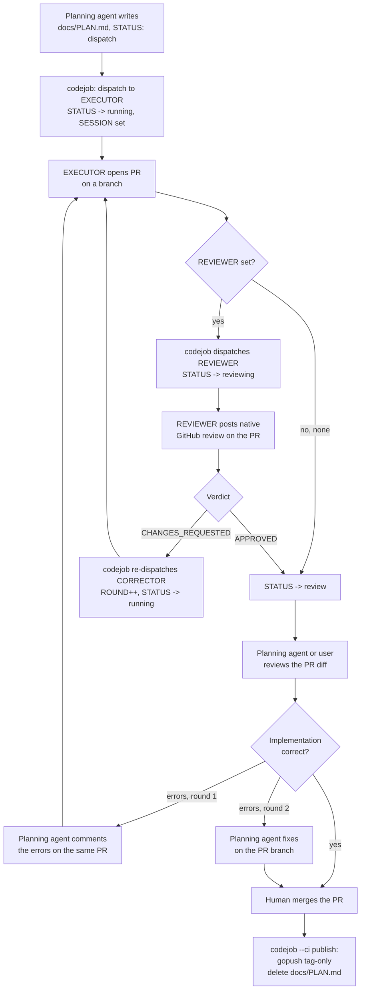

# CodeJob Agent Workflow

> How to write the actual content of a `PLAN.md` (structure, precision level,
> quality checklist, WebTyp-specific rules) is a separate domain: see skill
> **plan-authoring**. This skill covers the process around it — when to
> create one, the Q&A gate, dispatch, review, and local execution.

## The Planning Agent's Role in This Workflow

The agent reading this skill (Claude, Gemini, or any other installed LLM) acts **only as a planning and documentation agent**:

- Only edits `.md` files. Never executes code, shell commands, or compilers unless the user explicitly requests it.
- Never renames, moves, or deletes `docs/PLAN.md`. Its lifecycle (dispatch → running → reviewing → review → published+deleted) is managed automatically by `codejob`, driven entirely by the `STATUS` key in its own frontmatter — there is no `.env` state and no `CHECK_PLAN.md` anymore. **Single exception:** when the user decides a plan runs LOCALLY, it is renamed to `docs/LAST_PLAN_EXECUTED.md` — see "Local Execution Flow" below.
- Never applies a code fix directly when it affects more than 1 file: write a new `PLAN.md` and let codejob dispatch it. **Exception:** the second review round of a dispatched PR — see "Review rounds".

## When to Create `PLAN.md` vs Edit Directly

- **Edit `.md` files directly** (SKILL.md, README.md, ARCHITECTURE.md, etc.) — documentation changes need no plan.
- **Create `docs/PLAN.md`** whenever the task involves modifying or creating Go code. The user reviews it before dispatching. Content rules: skill **plan-authoring**.
- `docs/PLAN.md` is ALWAYS at the **module root level** (next to `go.mod`), never inside sub-packages.
- `docs/PLAN.md` MUST **open** with a frontmatter block — first line of the file is `---`, before any heading — or `codejob` refuses to dispatch it:

  ```markdown
  ---
  PLAN: "feat: what this plan implements"
  TAG: v0.2.0
  EXECUTOR: jules
  REVIEWER: none
  ---
  ```

  `PLAN` is required (the commit message used when closing the loop); everything
  else is optional. `STATUS`, `SESSION`, `REVIEW_SESSION`, `ROUND` and `PR` are
  **machine-written** — `codejob` updates them as the plan moves through its
  state machine; the planning agent never sets them by hand. Full key reference
  and details: skill **plan-authoring**.

### Never clobber an existing plan — `PLAN.md` becomes an execution queue

Before writing `docs/PLAN.md`, check whether one already exists with a pending plan:

1. **Existing plan found** → copy its full content to a descriptive file: `docs/PLAN_<TOPIC>.md` (topic in SCREAMING_SNAKE, e.g. `PLAN_KIND_UNIFICATION_INPUTSCHEMA.md`).
2. Write the new plan to its own `docs/PLAN_<NEW_TOPIC>.md`.
3. Rewrite `docs/PLAN.md` as an **execution queue**. The dispatch message the agent receives is always *"execute the plan described in docs/PLAN.md"*, so the queue MUST open with an explicit instruction that resolves that message to all of them:

   ```markdown
   # PLAN — execution queue for `<module>`

   > If you were told to "execute the plan described in docs/PLAN.md", execute
   > **ALL the plans below, in order (top to bottom)**. Each plan is
   > self-contained; finish one (its acceptance criteria green) before starting
   > the next. Never mix changes from one plan into another.

   | Order | Plan | Subject |
   |-------|------|---------|
   | 1 | [PLAN_<TOPIC>.md](PLAN_<TOPIC>.md) | ... |

   After completing all plans, run `gotest ./...` one final time: everything green.
   ```

4. **No existing plan** → write the plan directly in `docs/PLAN.md` (single-topic case; it stays dispatchable by `codejob` as-is).

### Local Execution Flow — `LAST_PLAN_EXECUTED.md`

Not every plan is dispatched. When the user decides an existing `docs/PLAN.md`
will be executed **locally** (immediately, in-session, instead of via codejob):

1. **Rename `docs/PLAN.md` → `docs/LAST_PLAN_EXECUTED.md` at that moment.**
   This frees `docs/PLAN.md` (no clash with codejob's rename/delete lifecycle
   or with other plans queued later) and marks the plan as locally owned.
2. Execute the work with `LAST_PLAN_EXECUTED.md` as the spec.
3. It is **committed together with its implementation on `gopush`** (the only
   publish path) — the executed spec lands in git history next to the code it
   produced.
4. On the NEXT local execution in the same repo: **overwrite the content** of
   the existing `docs/LAST_PLAN_EXECUTED.md` with the new plan — never create
   numbered variants (`LAST_PLAN_EXECUTED_2.md`). Git history preserves every
   previous version, so the repo keeps a detailed, commit-anchored record of
   what was done and when.
5. Its content ROTATES: other documents may point to it only as "the most
   recent locally executed plan" — never cite its sections or rely on
   specific content (same staleness rule as `PLAN.md` references).

### Master plan naming — never overwrite `MASTER_PLAN.md`

Multi-repo orchestrators at the monorepo root use a **descriptive name consistent with the task**: `docs/<TOPIC>_MASTER_PLAN.md` (e.g. `SIZE_OPTIMIZATION_MASTER_PLAN.md`, `MCP_DAEMON_HARDENING_MASTER_PLAN.md`). A bare `docs/MASTER_PLAN.md` likely already exists from a previous wave — never overwrite or reuse it for a new topic.

### Master plans are indexed, and declare their own status

The phase/gate order lives **inside** a master plan. The order **between** master
plans lives in `docs/MASTER_PLANS.md`. Without it nobody can answer "which wave
is running, and where do I start?" except from memory — and a repo that answers
that from memory has the same defect as a library that answers a contract from
memory.

So a new master plan is not finished until:

1. Its **second line** is the greppable status, so the index can be regenerated
   rather than remembered:
   `> **Status:** <PENDING | IN PROGRESS | SHIPPED | CLOSED> · <YYYY-MM-DD> · <one line>`
2. It links to `docs/MASTER_PLANS.md` and is **added as a row there**.
3. It states its **relation to prior waves** whose surface it touches — extends,
   supersedes, or independent — naming them. A wave that changes the behaviour of
   something a shipped wave published says so; silence there is how two plans end
   up disagreeing about the same symbol.

Before writing a new master plan, read the index: the wave may already exist, or
may be blocked by one that has not shipped.

## Planning Process (Q&A First)

The planning agent MUST perform a conversational Q&A with the user before writing any `PLAN.md`:

1. Read the relevant code before asking — do not ask questions the code already answers.
2. **Investigate prior art before proposing a mechanism**: the repo's git history, predecessor repos (pre-split origins), and settled decision records (ARCHITECTURE/DESIGN). When a decision record rejects an approach, verify its scope — it may have rejected a *different variant* than the one under consideration (e.g. "never execute the user's package" does not cover executing dependency packages).
3. **Never present a single take-it-or-leave-it proposal for an architectural choice.** Offer at least two candidate approaches with honest trade-offs and a recommendation, and wait for the user's decision. Writing a plan around an un-offered choice invalidates the plan.
4. Only write `docs/PLAN.md` once all decisions are resolved.

**The Q&A stays in chat. `PLAN.md` contains only final resolutions.**

> **If the task adds or changes any public API** (an exported symbol, a
> signature, a CLI flag, a file convention, a declaration format), the Q&A is not
> resolved until the five answers of skill **api-design** exist, and `PLAN.md`
> carries them in a `## Design gate` section. **A plan without it must not be
> dispatched** — the executing agent would be implementing a decision nobody
> made. Note that step 2's *internal* prior art (git history, decision records)
> does **not** satisfy that gate's first answer, which asks for at least three
> **external** frameworks.

## Plans Are Ephemeral — Rationale Lives in Permanent Docs

`docs/PLAN.md` is deleted by `codejob` the moment a human merges the PR (the
merge is what publishes). There is no intermediate rename anymore — the same
file goes `dispatch → running → reviewing → review → deleted`, all via its own
`STATUS` frontmatter key. Consequences:

- Anything that must outlive execution — decision rationale, rejected alternatives, contracts — goes to **permanent docs** (`ARCHITECTURE.md`, `DESIGN.md`) **before dispatch** (documentation-first). The plan's documentation stage then says **VERIFY the docs against the implementation**, never "create" them.
- **Permanent docs (README, ARCHITECTURE, DESIGN, SPECS, diagrams) must NEVER link to or cite `docs/PLAN.md`**, including section references like "PLAN §8" — they are guaranteed dead references once the plan is published and deleted. If a doc written ahead of implementation needs an interim marker, use a self-deleting note — `STATUS (remove this note when X lands): …` — and make its removal an explicit task in the plan. Note the plan's `STATUS` frontmatter key is unrelated to this convention — don't confuse the two.

## Plan Lifecycle

`STATUS` in `docs/PLAN.md`'s own frontmatter is the single source of truth —
every transition below is a git commit, so the loop runs identically locally or
in GitHub Actions (see skill **plan-authoring** for the full key reference).



### Every action is an explicit command — `codejob` alone only looks

| Command | What it does | Valid when STATUS is |
|---|---|---|
| `codejob` | help + read-only status of `docs/PLAN.md` and the suggested next command; touches nothing | any |
| `codejob dispatch` | sends `docs/PLAN.md` to the EXECUTOR | absent / `dispatch` |
| `codejob pull` | asks the agent; when the PR is ready, checks its branch out **in place** and moves STATUS to `review` (or `reviewing`). In `review`/`reviewing` it fetches the PR branch and fast-forwards the local one | `running`, `reviewing`, `review` |
| `codejob reply "text"` / `codejob approve` | answers / approves the agent session | `running` |
| `codejob close "message" [tag] [--release]` | fast-forwards to the PR head (stops if the branches diverged), merges, publishes with `gopush`, deletes `docs/PLAN.md` | `review` |

Any other word (including the old `codejob "message"`) is a usage error. Before this, bare
`codejob` advanced the state machine and, in `review`, merged and published an unreviewed
correction (2026-10-09); that is why nothing acts without its verb.

### Pulling an open PR — `codejob pull`, never `gh clone`/`gh pr checkout`

**The repo is already local — it is the same one the plan was dispatched
from.** Do not `gh repo clone` it elsewhere, and do not `gh pr checkout <n>` by
hand. `cd` into that existing local repo and run `codejob pull`: it detects the
agent's PR, moves `STATUS` to `review` (or `reviewing` if a `REVIEWER` ran), and
**checks out the PR branch in that same working tree**. Run it again after the
agent pushes a correction: it fast-forwards the local branch to the PR head.

```bash
cd <the local repo you dispatched from>
codejob pull       # STATUS: running -> review; PR branch checked out in place
codejob            # read-only: confirm STATUS and PR before reading
```

There is no `CHECK_PLAN.md` anymore. While a plan is in flight, `docs/PLAN.md`
stays under that exact name — only its `STATUS` frontmatter changes — so the
spec of what was supposed to be implemented is the same file, now on the PR
branch codejob just checked out.

When the user asks the planning agent to review a plan's PR (`STATUS: review`,
or `reviewing` if a `REVIEWER` already ran):

1. **Read `docs/PLAN.md` on the PR branch** (already checked out by `codejob pull` above) to understand what was planned (stages, expected outputs, criteria).
2. **Check the evidence before judging the code** — the PR is not what the agent *says* it did,
   it is what its commits contain. Every check below caught a real defect (2026-10-09):
   - **Commit by commit, not only the net diff.** List them —
     `gh pr view <url> --json commits --jq '.commits[]|.oid[0:7]+" "+.messageHeadline'` — and
     `git show --stat <sha>` each one. A later commit can delete or revert what an earlier one
     added; the net diff then looks empty or partial (layout#42: commit 1 added 7 files, commit 2
     deleted them). Never report "the code is missing" before looking at every commit.
   - **Every file the plan's stages table names appears in `git diff --stat main`.** If one is
     missing, find it in the commits (above) before concluding it was never written.
   - **Nothing deleted that the plan did not order deleted:** `git diff --stat main --diff-filter=D`
     (a removed test helper broke the whole wasm lane of patient_directory#5).
   - **No stray files:** `*.orig`, `*.rej`, scratch files (clinical_encounter#7).
   - **The local branch equals the PR head:** `codejob pull` fast-forwards it; never review or
     close from a branch that is behind the remote.
3. **Inspect the actual code** in the diff to verify each stage was executed correctly. When the
   plan touches a storage/transport contract, a test against the in-memory double is not enough:
   run (or add) a consumer test against a real backend (changelog#1 passed on `storage/mem` and
   panicked on SQLite).
4. **Verify documentation** — this is mandatory, agents frequently skip it:
   - `docs/API.md` updated if public API changed (new functions, types, signatures).
   - `docs/ARCHITECTURE.md` updated if design or structure changed.
   - `README.md` updated if usage examples or install instructions are affected.
   - `docs/SKILL.md` updated if the library's usage conventions changed.
   - Any doc explicitly listed as a deliverable in the plan must exist and be accurate.
   - If documentation is missing or stale → write a new `docs/PLAN.md` with only the doc fixes.
5. **Run the full suite yourself** (`gotest ./...`, both stdlib and wasm lanes) — the agent's "all green" is a claim, not evidence.
6. **If everything is correct (code + docs):** tell the user to merge the PR (cloud) — the merge itself publishes — or run `codejob close 'commit message'` locally to merge + `gopush` + delete `docs/PLAN.md` in one step.
7. **If something is missing or broken:** it depends on the review round — see "Review rounds" right below.

### Review rounds — comment first, fix second

- **Round 1 (first review of the PR): comment, do not fix.** Post every defect as a
  comment **on the same PR** so the executor corrects it on its own branch:
  `gh pr comment <PR-url> --body-file <file>` (one comment listing every finding:
  file:line, what is wrong, what the plan required, how to verify). Do not edit the
  code, do not write a new `docs/PLAN.md`. Then wait for the executor's next push.
- **Small fix exception (any round): fix it yourself right away.** If the correction is
  small — one file, one test, a few lines — apply it directly on the PR branch instead of
  commenting: the instruction to the executor would cost more tokens than the fix. The
  goal is the fewest tokens spent across agents.
- **Round 2 (the executor's correction is still wrong or incomplete): fix it
  yourself.** The executor already failed to understand the request once; asking
  again wastes time. Apply the fixes directly on the PR branch that `codejob pull`
  checked out, verify (`gotest`), commit them to that branch, and close the loop with
  `codejob close 'message'`. This is the one case where the planning agent edits code in a
  dispatched plan's loop, and it overrides the "never applies multi-file fixes" rule.
- A design error (the plan itself was wrong) is not a review round: Q&A with the user
  first.

### Concurrency — at most 15 plans in flight

- **Never more than 15 dispatched plans with `STATUS: running` at the same time** (Jules'
  concurrent-session limit), one `codejob` call per repo, one after the other.
- **One plan per repository at a time**: a repo whose `docs/PLAN.md` is running takes no second
  dispatch; park the next one as `docs/PLAN_<TOPIC>.md` and dispatch it after the merge.
- A plan whose PR is already delivered (`STATUS: review` or `reviewing`) **does not
  count** toward the 15: while you review it, dispatch the next plan in the queue.
- To wait for the executor, set a background timer (~10–15 min) and then run `codejob pull`
  in each dispatched repo — never poll in a tight loop.

### Source the executor cannot see — `_temp/`

When a plan ports code from a repo the executor has no access to (a private app, a
local archive), copy **only the files the plan needs** (the code being ported, its
tests and their helpers) into `<target-repo>/_temp/<source-repo>/<same path>` before
dispatching. **Never the whole repo**: no `.env`, `docs/`, `data/`, `config/` — the
target repo may be public and the copy stays in its git history. Grep the copy for
secrets before dispatch.

- `_temp/`, not `temp/`: Go ignores directories starting with `_`, so copied files
  that import the unreachable module do not break `go build ./...` or `gotest`.
- The plan says where the source is and why, and its **last stage deletes `_temp/`**
  in the same PR (verification: `test ! -e _temp`).

The planning agent **never**:
- Renames, moves, or deletes `docs/PLAN.md`, or edits its machine-owned frontmatter keys (`STATUS`, `SESSION`, `REVIEW_SESSION`, `ROUND`, `PR`) — all managed by `codejob` (sole exception: the rename to `LAST_PLAN_EXECUTED.md` when the user opts for local execution — see "Local Execution Flow").
- Merges the PR or runs `gopush` **to close a dispatched plan's loop** — that's the human's call (cloud) or `codejob close 'msg'` (local), which calls `gopush` internally. (Outside a plan loop, `gopush` is the normal publish path — see below.)
- Applies multi-file code fixes directly — always via a PR comment first, or a new `PLAN.md` (sole exception: the second review round, see "Review rounds").

## Publishing: `gopush` vs `codejob` — do not confuse them

They are not alternatives. **`gopush` publishes. `codejob` runs the plan loop**
(dispatch → running → reviewing → review → close) driven by `STATUS` in
`docs/PLAN.md`'s own frontmatter, and *calls `gopush` for you* at the end.

| You did… | Publish with | Why |
|---|---|---|
| Edited docs / a 1-file code fix, **no plan** | **`gopush 'message'`** | There is no plan and no PR. Nothing for `codejob` to close. |
| Wrote `docs/PLAN.md` and dispatched it | **`codejob close 'message'`** (local) or **merge the PR** (cloud) | Closes the loop: merges the PR, calls `gopush`, deletes `docs/PLAN.md`. |
| Ran a plan **locally** (`LAST_PLAN_EXECUTED.md`) | **`gopush 'message'`** | No PR was ever opened; the executed spec is committed alongside the code. |

`codejob` with no command is the way to "check something": it prints the plan's STATUS, PR,
session and the next command, and changes nothing. (`--ci <phase>` is the state machine
invoked non-interactively by the GitHub Action; the planning agent never calls `--ci` by hand.)

The planning agent **runs `codejob dispatch` when the user says "despacha"**:

```bash
codejob dispatch   # STATUS: dispatch -> running; sends docs/PLAN.md to the EXECUTOR
```

`codejob close` (close loop / publish, **local only**) can be run by **the planning agent or
the user** once `STATUS: review` and the review is done:

```bash
codejob close 'commit message'          # merge PR + gopush + delete docs/PLAN.md
codejob close 'commit msg' v0.2.0       # same with explicit tag
```

In the **cloud** setup (`codejob --init-action`), there is no local close step:
the human merges the PR from web/mobile, and that merge itself triggers
`codejob --ci publish` in the Action.

## Error Handling After Agent Execution

When `gotest` fails or the agent reports errors:

| Scenario | Planning agent's action |
|---|---|
| First review finds a small fix (1 file, 1 test) | Fix it yourself on the PR branch — cheaper than instructing the executor |
| First review of the PR finds errors | Comment them on the same PR (`gh pr comment`); the executor fixes them on its branch |
| The executor's correction is still wrong | Fix it yourself on the PR branch, verify, close with `codejob close 'message'` |
| PR already merged, error found later (1 file) | Write new `PLAN.md` with the exact fix (include code) |
| PR already merged, error found later (2+ files) | Write new self-contained `PLAN.md` with all changes |
| Design logic error | Q&A with user → new `PLAN.md` with resolved decision |
